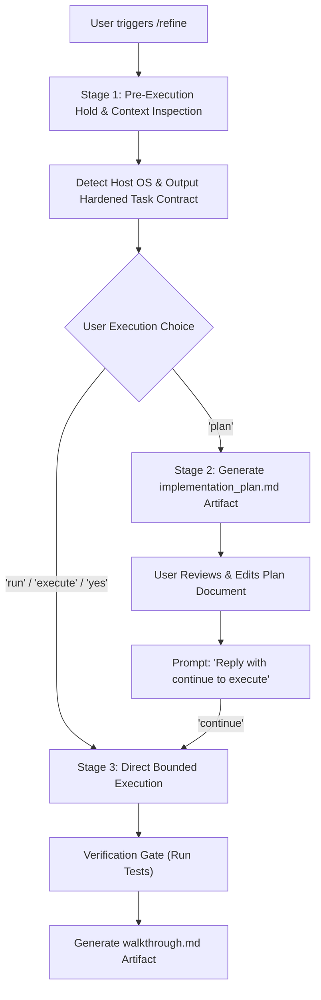

# 🎯 /refine — Context-Aware Task Refinement & Flexible Execution Skill for Google Antigravity

[](LICENSE)
[](https://antigravity.google)

A native skill and instruction hook for **Google Antigravity (AGY)** that intercepts rough, high-level task requests, inspects the concrete repository context—discovering exact file paths, test runners, build systems, and git status—and drafts a **hardened, deterministic execution contract**.

Works seamlessly on **Linux**, **macOS**, and **Windows** with full support for PowerShell, Bash, and native OS path conventions with **zero path conflicts**.

---

## ⚡ The Problem & The Solution

| The Typical Failure Mode | The `/refine` Workflow |
| :--- | :--- |
| Agent immediately jumps into editing random files based on vague prompts | **Pre-execution Hold**: Zero code edits until scope is agreed upon |
| Hallucinates generic paths (`src/app.py`, `server.go`) | **Context Inspection**: Scans real workspace files, routers, and modules |
| Guesses testing commands or skips verification | **Tooling & Test Gate**: Discovers project-specific test runners (`go test`, `pytest`, `npm test`, `dotnet test`, `make test`) |
| Path mismatches between Unix and Windows | **Cross-Platform Path Normalization**: Detects host OS and formats paths canonically with zero conflicts |
| Rigid workflows that force planning on tiny tasks | **Flexible Execution Choice**: Choose between direct execution or interactive planning |
| Unbounded scope creep | **Bounded Execution**: Modifies only what is explicitly approved in the contract or plan |

---

## 🚀 Flexible Execution Architecture

When triggered with `/refine <prompt>` or `refine: <prompt>`:



---

## 📦 Installation

### Option 1: Quick Install (One-Liner)

#### 🪟 Windows (PowerShell)
Open PowerShell and run:
```powershell
irm https://raw.githubusercontent.com/cluelessbaj/antigravity-refine/main/install.ps1 | iex
```
*To install globally for all Windows projects:*
```powershell
& ([scriptblock]::Create((irm https://raw.githubusercontent.com/cluelessbaj/antigravity-refine/main/install.ps1))) -Mode global
```

#### 🐧 Linux & 🍎 macOS (Bash / Zsh)
Open terminal and run:
```bash
curl -fsSL https://raw.githubusercontent.com/cluelessbaj/antigravity-refine/main/install.sh | bash
```
*To install globally across all Unix projects:*
```bash
curl -fsSL https://raw.githubusercontent.com/cluelessbaj/antigravity-refine/main/install.sh | bash -s -- global
```

---

### Option 2: Manual Installation

#### Per-Workspace Setup
Copy the files into your repository root:

**Windows (PowerShell):**
```powershell
New-Item -ItemType Directory -Force -Path .agents\skills\refine, .antigravity\skills
Copy-Item skills\refine\SKILL.md .agents\skills\refine\SKILL.md
Copy-Item .antigravity\skills\refine.md .antigravity\skills\refine.md
Copy-Item rules\AGENTS.md .\AGENTS.md
Copy-Item rules\GEMINI.md .\GEMINI.md
```

**Linux / macOS (Bash):**
```bash
mkdir -p .agents/skills/refine .antigravity/skills
cp skills/refine/SKILL.md .agents/skills/refine/SKILL.md
cp .antigravity/skills/refine.md .antigravity/skills/refine.md
cp rules/AGENTS.md ./AGENTS.md
cp rules/GEMINI.md ./GEMINI.md
```

#### Global Setup (Antigravity Plugin)
To enable `/refine` machine-wide across all workspaces:

1. Clone or copy this repository into your Antigravity plugin folder:
   - **Windows:** `git clone https://github.com/cluelessbaj/antigravity-refine.git $env:USERPROFILE\.gemini\config\plugins\refine`
   - **Linux/macOS:** `git clone https://github.com/cluelessbaj/antigravity-refine.git ~/.gemini/config/plugins/refine`
2. Enable it in your `config.json` (`%USERPROFILE%\.gemini\config\config.json` or `~/.gemini/config/config.json`):
   ```json
   {
     "plugins": {
       "refine": {
         "enabled": true
       }
     }
   }
   ```

---

## 🗺️ Cross-Platform Windows & Unix Path Matrix

Antigravity operates across multiple discovery layers. Here is the verified canonical path mapping:

| Surface / Scope | Linux / macOS Path | Windows Path |
| :--- | :--- | :--- |
| **Workspace Skill (Standard)** | `<root>/.agents/skills/refine/SKILL.md` | `<root>\.agents\skills\refine\SKILL.md` |
| **Workspace Skill (Native)** | `<root>/.antigravity/skills/refine.md` | `<root>\.antigravity\skills\refine.md` |
| **Workspace Rules** | `<root>/AGENTS.md`, `<root>/GEMINI.md` | `<root>\AGENTS.md`, `<root>\GEMINI.md` |
| **Global Plugin Directory** | `~/.gemini/config/plugins/refine/` | `%USERPROFILE%\.gemini\config\plugins\refine\` |
| **Global Plugin Manifest** | `~/.gemini/config/plugins/refine/plugin.json` | `%USERPROFILE%\.gemini\config\plugins\refine\plugin.json` |
| **Global Config File** | `~/.gemini/config/config.json` | `%USERPROFILE%\.gemini\config\config.json` |
| **Global Standalone Skill** | `~/.gemini/config/skills/refine/SKILL.md` | `%USERPROFILE%\.gemini\config\skills\refine\SKILL.md` |
| **App Builtin Skills** | `~/.gemini/antigravity/builtin/skills/refine/` | `%USERPROFILE%\.gemini\antigravity\builtin\skills\refine\` |
| **Global Runtime Rules** | `~/.gemini/antigravity/rules/refine.md` | `%USERPROFILE%\.gemini\antigravity\rules\refine.md` |

---

## 🛡️ Path Conflicts & Deduplication FAQ

#### Q: Will having both `AGENTS.md` and `GEMINI.md` cause duplicate prompt instructions?
**No.** Antigravity uses internal canonical content deduplication. Even if both `AGENTS.md` and `GEMINI.md` are discovered in the same directory, rules are deduplicated by their resolved identity so instructions are never injected more than once in a turn.

#### Q: What if a path has forward slashes (`/`) vs backslashes (`\`) on Windows?
**No conflicts.** The Antigravity language server (Go `filepath.Clean`) and desktop Electron runtime (Node `path.normalize`) automatically normalize path separators. Both `C:\project\server.py` and `C:/project/server.py` resolve to the exact same canonical file.

#### Q: How does Antigravity find the user profile on Windows?
Antigravity queries the Windows environment via standard APIs (`os.UserHomeDir()` in Go, `os.homedir()` in Node), which directly resolves to `%USERPROFILE%` (e.g. `C:\Users\YourName`).

---

## 💡 Usage

In the Antigravity chat input box, type your request using either prefix:

```text
/refine add a health check endpoint
```
or
```text
refine: implement redis caching for user profiles
```

> [!NOTE]
> **Client-Side Autocomplete Notice**: 
> Antigravity's chat UI has a client-side autocomplete menu for built-in platform shortcuts (`/goal`, `/schedule`, `/browser`, etc.). When typing `/refine`, the menu may say *"No matching results"*. **This is expected and does not block you.** Simply finish typing your prompt and press **Enter** (or press <kbd>Esc</kbd> to dismiss the popover). The agent will immediately intercept the command and run the contract workflow.

---

## 📄 License

[MIT](LICENSE) © [deadass@boi](https://github.com/cluelessbaj)
