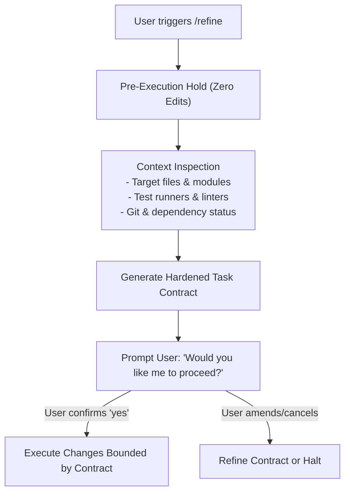

# 🎯 /refine — Context-Aware Task Refinement Skill for Google Antigravity

[](LICENSE)
[](https://antigravity.google)

A native skill and instruction hook for **Google Antigravity (AGY)** that intercepts rough, high-level task requests and inspects the concrete repository context—discovering exact file paths, test runners, build systems, and git status—to draft a **hardened, deterministic execution contract** before touching a single line of code.

---

## ⚡ The Problem & The Solution

| The Typical Failure Mode | The `/refine` Workflow |
| :--- | :--- |
| Agent immediately jumps into editing random files based on vague prompts | **Pre-execution Hold**: Zero code edits until the scope is agreed upon |
| Hallucinates generic paths (`src/app.py`, `server.go`) | **Context Inspection**: Scans real workspace files, routers, and modules |
| Guesses testing commands or skips verification | **Tooling & Test Gate**: Discovers project-specific test runners (`go test ./...`, `pytest`, `npm test`, `make test`) |
| Unbounded scope creep | **Hardened Contract**: Enforces bounded deliverables and lists untouchable files |

---

## 🚀 How It Works

When triggered with `/refine <prompt>` or `refine: <prompt>`:



### 📋 The Hardened Contract Template

Every refined task produces this deterministic contract before execution:

```markdown
## Refined Task Contract: [Concise Feature/Fix Name]

- **Target End-State:** [Measurable deliverable tailored to this repo]
- **Target Files:**
  - Modify: `[explicit paths to existing files]`
  - Create: `[explicit paths if new files are needed]`
  - Read-Only / Untouchable: `[configs, locks, dependencies, unrelated modules]`
- **Tooling & Test Gate:**
  - Verification command: `[exact test/lint command found in the project]`
  - Expected result: Exit code 0, 0 test failures.
- **Pre-flight Dependencies:** [Required environment variables, services, or ports]
```

---

## 📦 Installation

### Option 1: Quick Install (One-Liner)

Install to your current project workspace:
```bash
curl -fsSL https://raw.githubusercontent.com/cluelessbaj/antigravity-refine/main/install.sh | bash
```

Or install globally across all Antigravity projects:
```bash
curl -fsSL https://raw.githubusercontent.com/cluelessbaj/antigravity-refine/main/install.sh | bash -s -- global
```

---

### Option 2: Manual Installation

#### Per-Workspace Setup
Copy the files into your repository root:
1. Copy `skills/refine/SKILL.md` to `.agents/skills/refine/SKILL.md` (or `.antigravity/skills/refine.md`).
2. Copy `rules/AGENTS.md` (or `rules/GEMINI.md`) to your workspace root.

```bash
mkdir -p .agents/skills/refine .antigravity/skills
cp skills/refine/SKILL.md .agents/skills/refine/SKILL.md
cp .antigravity/skills/refine.md .antigravity/skills/refine.md
cp rules/AGENTS.md ./AGENTS.md
cp rules/GEMINI.md ./GEMINI.md
```

#### Global Setup (Antigravity Plugin)
To enable `/refine` for every workspace on your machine:

1. Clone or copy this repository into `~/.gemini/config/plugins/refine/`:
   ```bash
   git clone https://github.com/cluelessbaj/antigravity-refine.git ~/.gemini/config/plugins/refine
   ```
2. Enable it in `~/.gemini/config/config.json`:
   ```json
   {
     "plugins": {
       "refine": {
         "enabled": true
       }
     }
   }
   ```

---

## 💡 Usage

In the Antigravity chat input box, type your request using either prefix:

```text
/refine add a health check endpoint
```
or
```text
refine: implement redis caching for user profiles
```

> [!NOTE]
> **Client-Side Autocomplete Notice**: 
> Antigravity's chat UI has a client-side autocomplete menu for built-in platform shortcuts (`/goal`, `/schedule`, `/browser`, etc.). When typing `/refine`, the menu may say *"No matching results"*. **This is expected and does not block you.** Simply finish typing your prompt and press **Enter** (or press <kbd>Esc</kbd> to dismiss the popover). The agent will immediately intercept the command and run the contract workflow.

---

## 🔍 Example Walkthrough

**Input:**
```text
/refine add a health check endpoint
```

**Agent Output:**
> ```markdown
> ## Refined Task Contract: Add Health Check Endpoint to HTTP Server
> 
> - **Target End-State:** 
>   - Expose a dedicated `GET /health` (and `HEAD /health`) endpoint returning HTTP status 200 with JSON payload `{"status": "ok"}` and `Content-Type: application/json`.
>   - Non-blocking execution integrated cleanly into `EmoteHandler.handle_request()` without altering existing media routing (`/g/`, `/e/`, `/media/`).
> 
> - **Target Files:**
>   - Modify: `/home/user/myproject/server.py`
>   - Create: `[none]`
>   - Read-Only / Untouchable: 
>     - `/home/user/myproject/cloudflared` (binary tunnel runner)
>     - `/home/user/myproject/public/media/*` (static asset repository)
>     - Existing handlers for `/g/`, `/e/`, and `/media/`
> 
> - **Tooling & Test Gate:**
>   - Verification command: `python3 -m py_compile /home/user/myproject/server.py && pytest tests/`
>   - Expected result: Exit code 0, 0 test failures.
> 
> - **Pre-flight Dependencies:**
>   - Python 3 runtime
>   - Local port `8088`
> ```
> 
> **"Would you like me to proceed with executing this specification?"**

Once you confirm (`yes`, `proceed`, or `run`), the agent executes the bounded modifications and verifies the outcome against the test gate.

---

## 📄 License

[MIT](LICENSE) © [deadass@boi](https://github.com/cluelessbaj)
