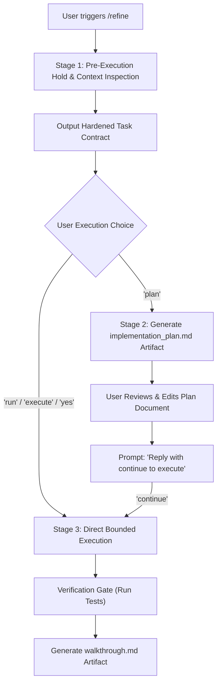

# 🎯 /refine — Context-Aware Task Refinement & Flexible Execution Skill for Google Antigravity

[](LICENSE)
[](https://antigravity.google)

A native skill and instruction hook for **Google Antigravity (AGY)** that intercepts rough, high-level task requests, inspects the concrete repository context—discovering exact file paths, test runners, build systems, and git status—and drafts a **hardened, deterministic execution contract**.

It gives you full control over how to proceed: choose **Direct Execution** for quick, verified implementations, or enter **Interactive Planning Mode** to review and adjust a detailed architectural plan before any code is modified.

---

## ⚡ The Problem & The Solution

| The Typical Failure Mode | The `/refine` Workflow |
| :--- | :--- |
| Agent immediately jumps into editing random files based on vague prompts | **Pre-execution Hold**: Zero code edits until scope is agreed upon |
| Hallucinates generic paths (`src/app.py`, `server.go`) | **Context Inspection**: Scans real workspace files, routers, and modules |
| Guesses testing commands or skips verification | **Tooling & Test Gate**: Discovers project-specific test runners (`go test ./...`, `pytest`, `npm test`, `make test`) |
| Rigid workflows that force planning on tiny tasks | **Flexible Execution Choice**: Choose between direct execution or interactive planning |
| Unbounded scope creep | **Bounded Execution**: Modifies only what is explicitly approved in the contract or plan |

---

## 🚀 Flexible Execution Architecture

When triggered with `/refine <prompt>` or `refine: <prompt>`:



---

### 📋 Stage 1: The Hardened Contract Template

Every refined task produces this deterministic contract for initial alignment:

```markdown
## Refined Task Contract: [Concise Feature/Fix Name]

- **Target End-State:** [Measurable deliverable tailored to this repo]
- **Target Files:**
  - Modify: `[explicit paths to existing files]`
  - Create: `[explicit paths if new files are needed]`
  - Read-Only / Untouchable: `[configs, locks, dependencies, unrelated modules]`
- **Tooling & Test Gate:**
  - Verification command: `[exact test/lint command found in the project]`
  - Expected result: Exit code 0, 0 test failures.
- **Pre-flight Dependencies:** [Required environment variables, services, or ports]
```

#### Awaiting Your Decision:
> **How would you like to proceed?**
> - **Direct Execution:** Reply `run`, `execute`, or `yes` to apply changes directly bounded by this contract.
> - **Interactive Planning:** Reply `plan` to generate a detailed `implementation_plan.md` artifact for review first.
> - Or reply with any adjustments you'd like to make to the contract.

---

### 📝 Stage 2: Interactive Planning Phase (Optional)

If you reply with `plan`, `/refine` creates a dedicated `implementation_plan.md` artifact:
- **Component-by-Component Breakdown**: Every file change is designated as `[MODIFY]`, `[NEW]`, or `[DELETE]`.
- **Review Items & Open Questions**: Highlights breaking changes or architectural trade-offs.
- **Editable & Collaborative**: You can edit the plan document directly in Antigravity or ask the agent to tweak specific parts.
- **Continuation Gate**: Code execution only begins when you respond with `continue`, `proceed`, or `run`.

---

## 📦 Installation

### Option 1: Quick Install (One-Liner)

Install to your current project workspace:
```bash
curl -fsSL https://raw.githubusercontent.com/cluelessbaj/antigravity-refine/main/install.sh | bash
```

Or install globally across all Antigravity projects:
```bash
curl -fsSL https://raw.githubusercontent.com/cluelessbaj/antigravity-refine/main/install.sh | bash -s -- global
```

---

### Option 2: Manual Installation

#### Per-Workspace Setup
Copy the files into your repository root:
```bash
mkdir -p .agents/skills/refine .antigravity/skills
cp skills/refine/SKILL.md .agents/skills/refine/SKILL.md
cp .antigravity/skills/refine.md .antigravity/skills/refine.md
cp rules/AGENTS.md ./AGENTS.md
cp rules/GEMINI.md ./GEMINI.md
```

#### Global Setup (Antigravity Plugin)
To enable `/refine` for every workspace on your machine:

1. Clone or copy this repository into `~/.gemini/config/plugins/refine/`:
   ```bash
   git clone https://github.com/cluelessbaj/antigravity-refine.git ~/.gemini/config/plugins/refine
   ```
2. Enable it in `~/.gemini/config/config.json`:
   ```json
   {
     "plugins": {
       "refine": {
         "enabled": true
       }
     }
   }
   ```

---

## 💡 Usage

In the Antigravity chat input box, type your request using either prefix:

```text
/refine add a health check endpoint
```
or
```text
refine: implement redis caching for user profiles
```

> [!NOTE]
> **Client-Side Autocomplete Notice**: 
> Antigravity's chat UI has a client-side autocomplete menu for built-in platform shortcuts (`/goal`, `/schedule`, `/browser`, etc.). When typing `/refine`, the menu may say *"No matching results"*. **This is expected and does not block you.** Simply finish typing your prompt and press **Enter** (or press <kbd>Esc</kbd> to dismiss the popover). The agent will immediately intercept the command and run the contract workflow.

---

## 📄 License

[MIT](LICENSE) © [deadass@boi](https://github.com/cluelessbaj)
